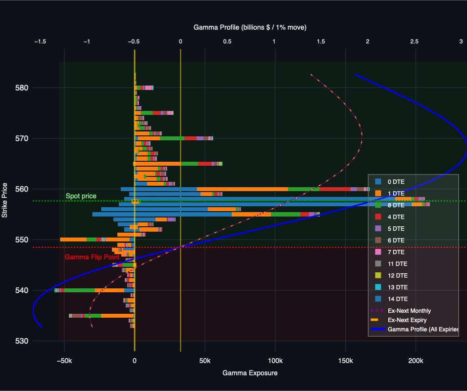

# Gamma Exposure Chart

A Streamlit application that visualizes options gamma exposure data from CBOE. This tool helps traders and analysts understand market positioning through gamma exposure charts.



## Features

- Upload CBOE options chain data in CSV format
- Visualize gamma exposure across different strike prices
- Filter by days to expiration (DTE)
- Adjust strike price range around the current spot price
- Interactive chart with detailed hover information
- Supports both stacked and grouped bar visualization modes

## Live Demo

Try the application online: [Gamma Exposure Chart App](https://gamma-chart.streamlit.app)

## How to Use

1. Visit the app or run locally
2. Upload a CSV file from CBOE's delayed quotes page or use the default data
3. Adjust the DTE and strike range filters as needed
4. Hover over bars to see detailed information

## Local Development

To run the app locally:

```bash
streamlit run app.py
```
